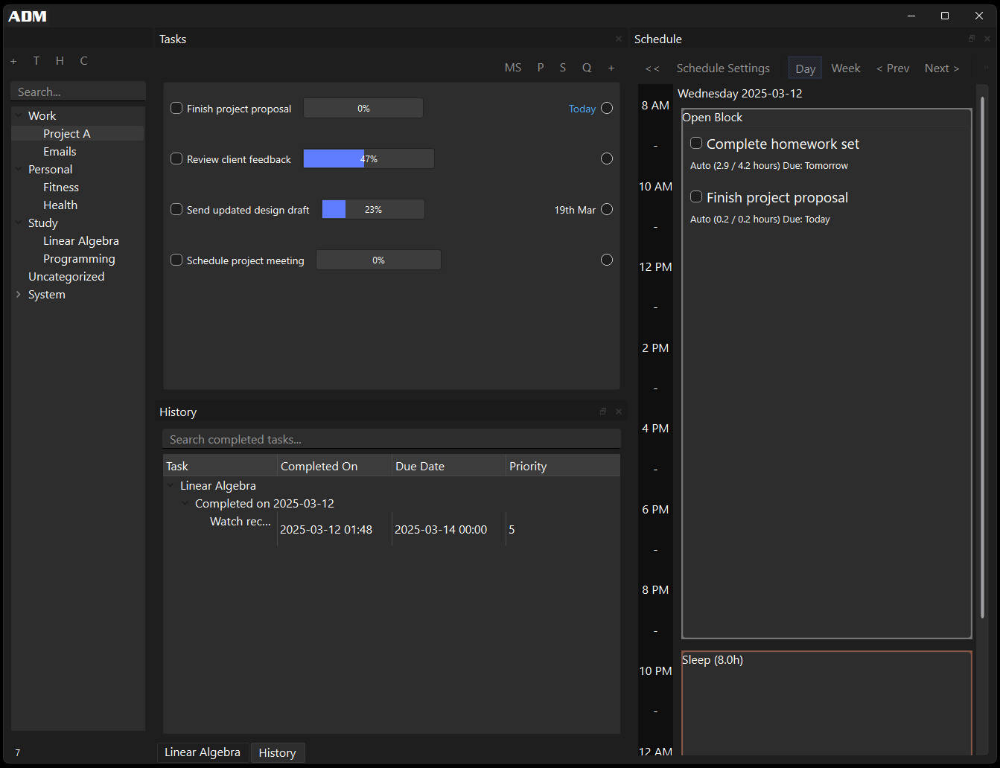
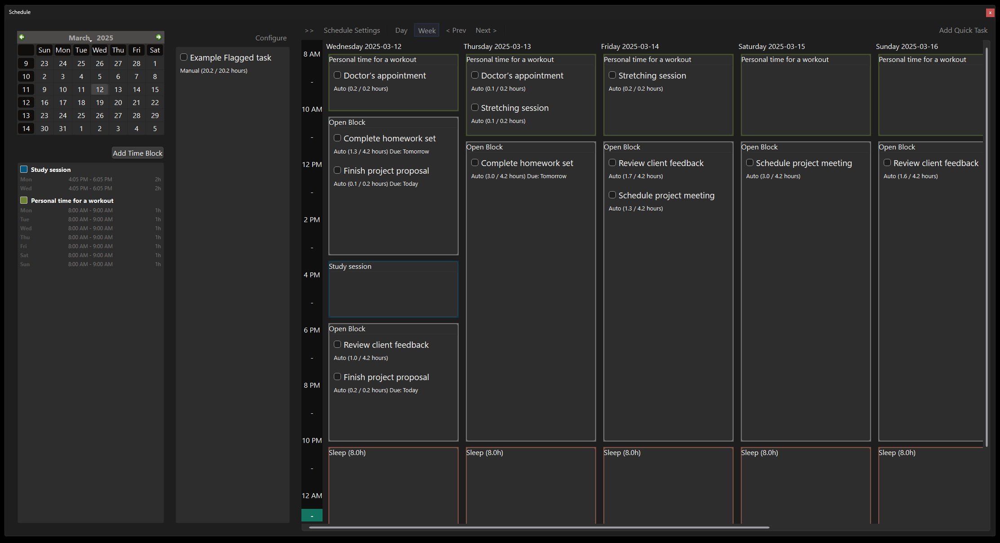
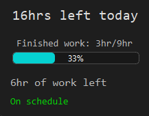
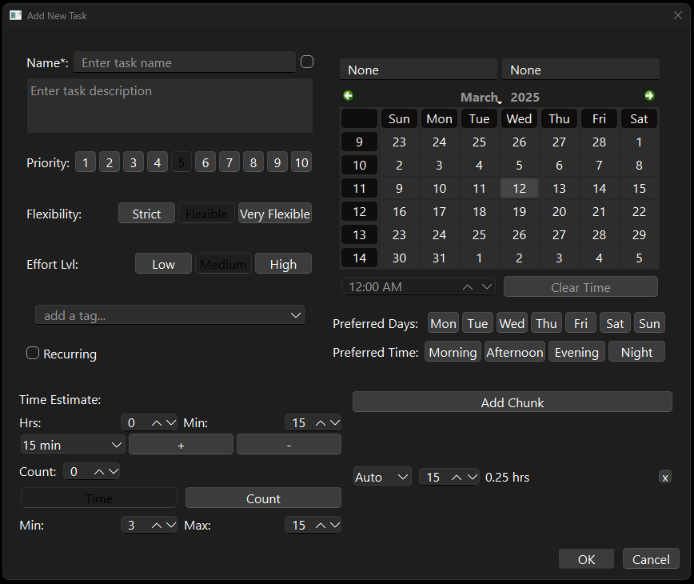
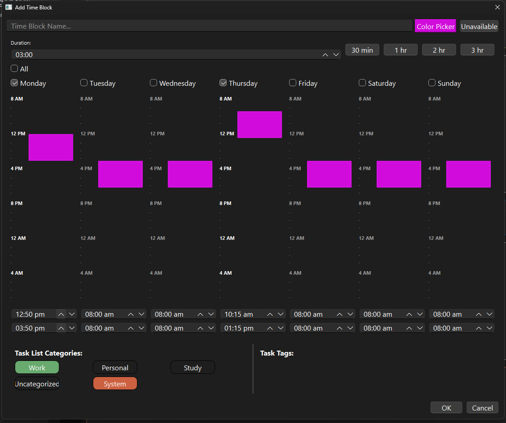
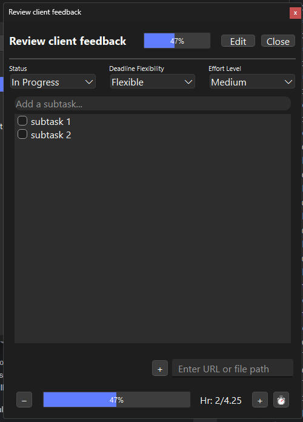
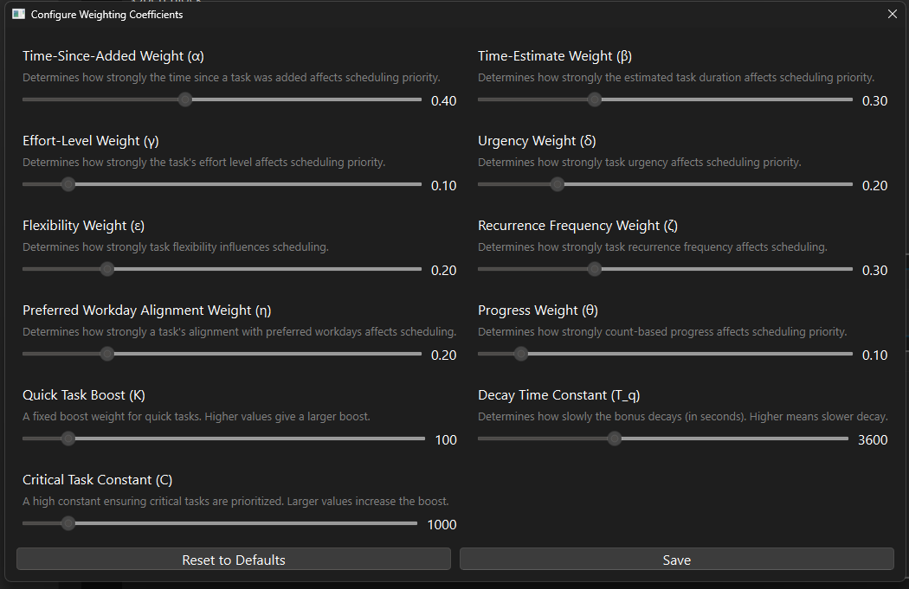
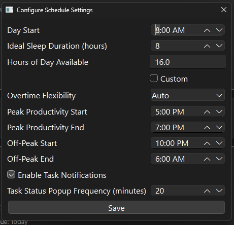

<p style="margin-bottom: 0;"></p>

## Advanced Day Manager (ADM-2)


> ### Clarity amidst chaos

**Advanced Day Manager (ADM-2) is a feature-packed, open-source task management and scheduling application** designed to help you streamline your day. ADM combines robust task management with automated scheduling capabilities, enabling you to prioritize tasks, track progress, and generate a structured daily plan—all in one place.  

I built ADM-2 to reliably manage complex schedules and bring order to the overwhelming flow of daily tasks. Imagine starting your day with a perfectly structured schedule—each task thoughtfully placed into a time block that fits your available hours and priorities, with clear gaps showing exactly how much free time you have left. ADM-2 tracks your progress in real time, adjusting the schedule dynamically as you complete tasks, so you always know if you’re ahead or behind—and by exactly how much.  

It intelligently handles shifting priorities, conflicts, and unexpected changes, so you can stay focused and in control, no matter how unpredictable your day becomes.  

---

### **Screenshots**  

| **Home View** | **Schedule View** |  
|:------------:|:----------------:|  
|  |  |  

| **Time Stats View** | **Add Task View** | **Add Time Block View** |  
|:------------------:|:----------------:|:-----------------------:|  
|  |  |  |  

| **Task Detail View** | **Configure Weighting Coefficients View** | **Schedule Settings View** |  
|:-------------------:|:---------------------------------------:|:--------------------------:|  
|  |  |  |  

---

## 📖 **Learn More**  

### ⭐👉 **[Scheduling](./docs/features/scheduling.md)** – Understand how ADM-2 dynamically schedules tasks and resolves conflicts.
👉 **[Task Management](./docs/features/task_management.md)** – Learn how ADM-2 handles task creation, organization, and prioritization.  
👉 **[Explore All Features](./docs/overview.md)** – Get a deep dive into every capability ADM-2 offers.  
👉 **[Technologies Behind ADM-2](./docs/technologies.md)** – See the tools and frameworks that power ADM-2.  

---

## Key Features  

### Flexible Task Management  
- **Category** – Represents a top-level grouping to organize tasks across different areas of life (e.g., Work, Personal, Projects). Each category can hold multiple task lists.  
- **Task List** – A collection of tasks under a category that can be enabled or disabled for scheduling. Task lists allow bulk organization and filtering of related tasks.  
- **Task** – Create tasks with rich attributes like descriptions, due dates, priorities, categories, time estimates, and resources. Tasks are scheduled into time blocks based on available hours and scheduling rules.  
- Quickly mark tasks as completed or important.  
- Organize tasks into lists and categories with ease.  

### Subtasks and Recurring Tasks  
- Break down large tasks into manageable subtasks.  
- Handle recurring tasks automatically based on custom schedules.  
- Reopen recurring tasks automatically to avoid losing track of ongoing responsibilities.  

### Automated Scheduling  
- **Time Block** – A defined period in the schedule where tasks are placed. Time blocks can be user-defined or automatically generated based on task attributes and availability.  
- **Schedule** – The structured daily plan built from time blocks. The schedule updates dynamically in real time as tasks are completed, delayed, or reprioritized.  
- Generate a daily schedule based on task priorities, time estimates, flexibility, and preferred working hours.  
- Adjust dynamically based on real-time progress and shifting priorities.  
- Handles conflicts between overlapping tasks without user input.  

### Calendar and History Views  
- Visualize tasks on a calendar for a quick overview of deadlines and due dates.  
- Review completed tasks in the history section and restore them if needed.  

### Integrated Productivity Tools  
- Track effort using count and time-based progress bars.  
- Manage task-related resources and maintain notes within the app.  
- Receive proactive suggestions for improving workflow.  

### Customizable Sorting and Filtering  
- Sort tasks by priority, urgency, time estimate, or category.  
- Apply custom filters and multi-selection for batch task management.   

---

## Why Time Management Feels Impossible  
Managing time effectively is hard. Tasks pile up, priorities shift, and available hours disappear faster than expected. Traditional to-do list apps fail because they treat tasks as static lists, leaving you to figure out how to fit everything into your day manually.  

- **Tasks shift constantly:** Meetings get rescheduled, deadlines change, and new commitments pop up.  
- **Rigid scheduling fails:** Most tools create fixed schedules that don’t adapt to these real-life changes.  
- **No understanding of context:** To-do lists don’t account for how difficult or flexible a task is—or when you work best.  

**ADM-2 solves this by handling complexity for you.** It creates a structured yet flexible daily schedule that adapts dynamically as your day unfolds—handling priority changes, conflicts, and real-time progress tracking automatically.  

---

## How It Works  
1. **Define Tasks and Lists** – Create categories and task lists, then add tasks with up to **15 attributes** to classify them. These attributes determine how tasks are prioritized, scheduled, and adjusted within the schedule.  
2. **Generate Schedule** – ADM-2 builds a structured daily schedule by assigning tasks to available time blocks based on priority, effort, and available hours.  
3. **Track Progress** – As tasks are completed, the schedule updates in real time, shifting tasks and recalculating available time.  
4. **Handle Conflicts** – If tasks overlap or deadlines change, ADM-2 automatically adjusts the schedule to resolve conflicts.  
5. **Manual Adjustments** – The user can override or adjust the schedule at any time without breaking the underlying structure.  

---

## How It’s Different  
ADM-2 isn’t just another to-do list or calendar—it’s a **real-time scheduling engine** designed to handle complexity. Here’s how it stands out:  

- **Dynamic Scheduling:** Adjusts task order and time blocks automatically as progress is made.  
- **Real-Time Conflict Resolution:** If a task runs over time or a new task is added, the schedule self-corrects without needing manual input.  
- **Intelligent Prioritization:** Tasks are scheduled based on effort, priority, flexibility, and context—not just order of input.  
- **Context-Aware Scheduling:** ADM-2 considers when you work best (e.g., peak hours) and schedules high-effort tasks accordingly.  
- **Smart Rebalancing:** If tasks are delayed or completed early, ADM-2 automatically rebalances the remaining schedule to maximize productivity.  
- **Manual Override Without Breaking:** You can manually adjust the schedule, and ADM-2 will intelligently adapt without losing structure.  

---

## Who It’s For  
- **Students** – Manage classes, assignments, and study sessions while balancing free time.  
- **Professionals** – Handle work projects, deadlines, and meetings without losing track.  
- **Creatives** – Organize long-term projects and creative output with structured planning.  
- **Goal-Oriented Individuals** – Maintain focus on both short-term and long-term goals with dynamic tracking and adjustment.  

Defining each task takes some upfront effort—you’ll need to provide details like effort, priority, flexibility, and time estimates—but this is a trade-off that’s well worth the results. By giving ADM-2 enough context, it can create a highly accurate, adaptable schedule that reflects your real-life workload and adjusts dynamically as things change.  

---

## Themes (Coming Soon)  
Customize ADM with your own CSS themes. A dedicated setup will allow easy theme installation and switching for both Windows and Linux users.  

---

## Installation and Setup  

### Installer (Coming Soon)  
A user-friendly installer for Windows and Linux is under development to make setup quick and easy.  

### Manual Setup  
1. **Clone the Repository:**  
   ```bash
   git clone https://github.com/yourusername/ADM.git
   cd ADM
   ```  

2. **Install Dependencies:**  
   Use `requirements.txt` to quickly install all required dependencies:  
   ```bash
   pip install -r requirements.txt
   ```  

3. **Run ADM:**  
   ```bash
   python main.py
   ```  

---

## Contributing  
Contributions are welcome.  
- Report issues, suggest new features, or improve the documentation.  
- Open an issue or submit a pull request.  

---

## License

This project is licensed under the **AGPL-3.0** License - see the [LICENSE](agpl-3.0.md) file for details.

This file is part of **Advanced Day Manager (ADM-2)**.

**Advanced Day Manager (ADM-2)** is free software: you can redistribute it and/or modify it under the terms of the GNU Affero General Public License as published by the Free Software Foundation, either version 3 of the License, or (at your option) any later version.

**Advanced Day Manager (ADM-2)** is distributed in the hope that it will be useful, but **WITHOUT ANY WARRANTY**; without even the implied warranty of MERCHANTABILITY or FITNESS FOR A PARTICULAR PURPOSE. See the GNU Affero General Public License for more details.

You should have received a copy of the GNU Affero General Public License along with **Advanced Day Manager (ADM-2)**. If not, see <http://www.gnu.org/licenses/>.


---

**ADM-2 is continuously evolving** — its focus on flexible organization, automated scheduling, and user control makes it an essential tool for anyone looking to optimize their daily workflow.  

Try ADM-2 today and take control of your schedule!